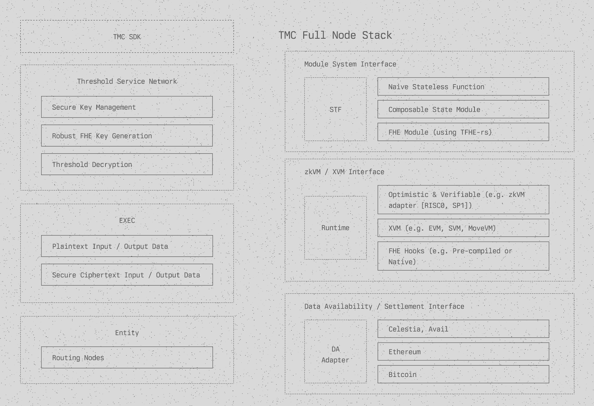
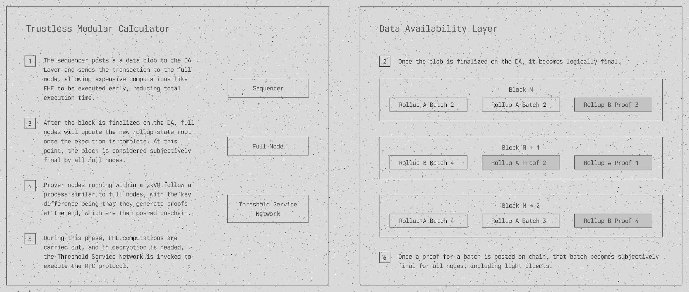

# TMC (Trustless Modular Calculator)

> [!IMPORTANT]  
> To enable FHE modules, please visit [`fhe-module`](https://github.com/cyferio-labs/tmc/tree/fhe-modules) branch

## Overview

TMC is a modular co-processor and rollup stack enabling verifiable Fully Homomorphic Encryption (FHE). It unlocks privacy-preserving, massively parallel execution of computations for both Web2 and Web3 applications.

By leveraging FHE, advanced modular rollup designs, and parallelism in computational proofs within a trustless computing layer, TMC enables secure, near real-time computations on both public and private on-chain states while preserving composability and interoperability.

## Key Features

- **Modular Architecture**: Highly adaptable zk-rollup framework integrating state-of-the-art privacy-preserving solutions like FHE and Zero-Knowledge Proofs (ZKPs).
  
- **Module System Interface**:
  - Supports both stateless and stateful modules, enhancing composability.
  - Incorporates FHE-powered modules using the TFHE-rs library for computations on encrypted data.

- **Data Availability Interface**:
  - Integrates with various data availability solutions (e.g., Celestia, Avail).
  - Compatible with mainstream Layer 1 blockchains for settlement layers.

- **zkVM Interface**:
  - Supports optimistic, zero-knowledge, and verifiable FHE virtual machines.
  - Compatible with various zkVMs, including RISC Zero and SP1.
  - Produces succinct verifiable proofs for transaction executions.

- **Threshold Service Network**:
  - Secure key management for FHE keys.
  - Robust FHE key generation and threshold decryption using MPC protocols.

<p align="center">
 
    <br>
    <em>The Architecture of TMC</em>
</p>

## Use Cases

- **DeFi**:
  - **Dark Pools**: Enable private large trades to reduce market impact.
  - **Blind Auctions**: Conduct auctions with hidden bids to prevent manipulation.
  - **MEV-Resistant DEXs**: Build exchanges where transactions can't be front-run.
  - **Enhanced Privacy**: Improve transaction confidentiality beyond current blockchain capabilities.

- **Social Applications**:
  - **Efficient Identity Verification**: Perform identity checks without constant off-chain data retrieval.
  - **Privacy-Preserving Interactions**: Ensure all user interactions remain private.

- **Gaming**:
  - **Real-Time Response**: Enable near real-time transaction responses in distributed systems.
  - **Secure Interactions**: Operate nodes in a "dark forest" state for enhanced security.
  - **Asset Integration**: Flexible combination of DeFi and GameFi assets.
  - **Flexible Gas Fees**: Implement dynamic gas fee structures to lower entry barriers.

<p align="center">
 
    <br>
    <em>The Workflow of TMC</em>
</p>

## Getting Started

Explore our demo at [beta.cyferio.com](https://beta.cyferio.com) and watch our [demo video](https://www.youtube.com/watch?v=iYxvFWpbi2s).

# Rollup Starter for `sov_bank_fhe`

This guide provides step-by-step instructions for setting up and interacting with the `sov_bank_fhe` module, which enables confidential token operations using Fully Homomorphic Encryption (FHE).

## Prerequisites

- **Rust and Cargo**: Ensure they are installed on your system.
- **Project Code**: Clone or download the latest code from the `fhe-module` branch.
- **Terminal Access**: Familiarity with terminal commands.

## Setup

### 1. Configure the Environment

We use an optimistic-like rollup configuration since applying a zk prover to FHE is still under development.

Set the following environment variables:

```sh
export SKIP_GUEST_BUILD=1
export SOV_PROVER_MODE=skip
```

### 2. Set Up FHE Keys

The rollup requires a set of keys: `{public key, server key, private key}`.

> **Note**: For demo purposes, keys are stored insecurely in a JSON file. In production, store the public and server keys securely on-chain and the private key within the node.

Generate the FHE keys:

```sh
# Run this command in the project root directory

cargo run --release --bin fhe-keygen
```

### 3. Generate Call Messages for `sov_bank_fhe`

These scripts will be used to invoke confidential operations like token creation, transfer, and minting.

Generate the scripts:

```sh
# Run this command in the project root directory

cargo run --release --bin request-scripts-gen
```

## Running the Node

### 1. Navigate to the Rollup Directory

```sh
cd crates/rollup/
```

### 2. Clean the Database and Wallet (Optional)

To start with a fresh rollup:

```sh
make clean-db
make clean-wallet
```

> **Note**: Skip this step if you wish to retain the previous wallet setup.

### 3. Start the Rollup Node

Compile and start the rollup node:

```sh
# Ensure environment variables are set
# Use --release for optimized performance

cargo run --release --bin node
```

## Interacting with `sov_bank_fhe`

### 1. Open a New Terminal

- Navigate to the `crates/rollup/` directory.
- Ensure the environment variables from the [configuration section](#1-configure-the-environment) are set.

### 2. Build `sov-cli` and Import Keys

Import the token deployer's keys from `test-data/keys/token_deployer_private_key.json`:

```sh
make import-keys
```

### 3. Query the FHE Public Key via RPC

Retrieve the FHE public key for encrypting transactions:

```sh
make get-fhe-public-key
```

### 4. Create Confidential Tokens

Create and mint 1,000 encrypted tokens to the address `sov1l6n...r94`:

```sh
# Wait 5–10 seconds for the transaction to complete

make test-fhe-create-token
```

Monitor the server logs for FHE operations.

### 5. Query the Total Supply of Tokens

Fetch the total token supply:

- **Encrypted (Ciphertext):**

  ```sh
  make test-fhe-bank-raw-supply-of
  ```

- **Decrypted (Plaintext):**

  ```sh
  make test-fhe-bank-supply-of
  ```

### 6. Mint Additional Confidential Tokens

Mint an additional 500 encrypted tokens to the same address:

```sh
# Wait 5–10 seconds for the transaction to complete

make test-fhe-mint-token
```

Verify the updated total supply as in the previous step.

### 7. Transfer Confidential Tokens

Transfer 100 encrypted tokens from `sov1l6n...r94` to `sov15vs...7gc`:

```sh
# Wait 5–10 seconds for the transaction to complete

make test-fhe-token-transfer
```

### 8. Query User Balance via RPC

Replace `"user_address": "ADDRESS_TO_QUERY"` with the desired address.

#### Encrypted Balance (Ciphertext)

```sh
curl -sS -X POST -H "Content-Type: application/json" \
-d '{"jsonrpc":"2.0","method":"fheBank_rawBalanceOf","params":{"user_address":"sov1l6n...r94", "token_id":"TOKEN_ID"},"id":1}' \
http://127.0.0.1:12345
```

#### Decrypted Balance (Plaintext)

```sh
curl -sS -X POST -H "Content-Type: application/json" \
-d '{"jsonrpc":"2.0","method":"fheBank_balanceOf","params":{"user_address":"sov1l6n...r94", "token_id":"TOKEN_ID"},"id":1}' \
http://127.0.0.1:12345
```

## Notes

- **Security Considerations**: This setup is for demo purposes. In production, implement secure key storage and management practices.
- **Performance**: Use `--release` mode for faster FHE operations.
- **Monitoring**: Check server logs to monitor FHE operations and transaction processing.

Feel free to explore and contribute to the project. For any questions or issues, please open an issue or contact the maintainers.
